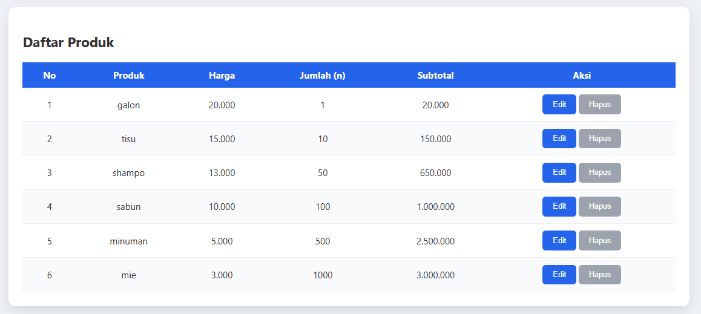
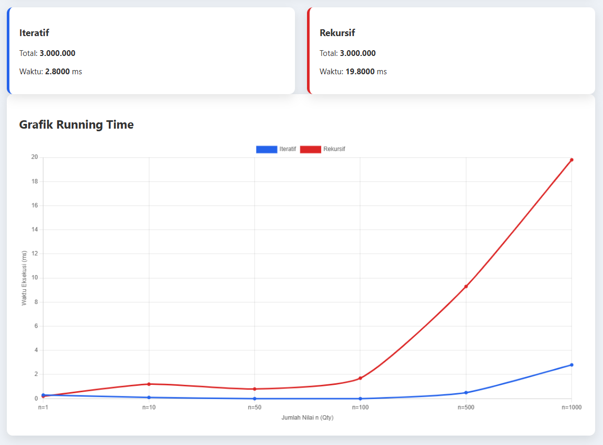

# Analisis Kompleksitas Algoritma: Keranjang Belanja
**Tugas Besar Mata Kuliah Analisis Kompleksitas Algoritma**

Aplikasi berbasis web sederhana untuk menganalisis dan membandingkan efisiensi algoritma **Iteratif** dan **Rekursif** dalam menghitung akumulasi total harga pada keranjang belanja.

## 👥 Anggota Kelompok
* Vicky Fareli - 103012400414
* Muh Akmal Okhi Ananta - 103012400408

## 📝 Studi Kasus
Studi kasus yang dipilih adalah **Kalkulasi Akumulatif Keranjang Belanja**. Permasalahan ini dipilih karena merupakan implementasi nyata dari pengolahan data linear. Algoritma difokuskan pada penjumlahan harga produk sebanyak `n` kali (kuantitas) untuk melihat bagaimana sistem menangani beban kerja yang meningkat.

## ⚙️ Algoritma yang Diimplementasikan
Kami membandingkan dua pendekatan untuk menyelesaikan masalah yang sama:

### 1. Versi Iteratif
Menggunakan struktur kontrol perulangan (`for loop`). Algoritma ini menjumlahkan harga secara langsung dalam satu blok eksekusi.
* **Kelas Kompleksitas Waktu**: $O(n)$
* **Karakteristik**: Penggunaan memori stabil (Constant Space).

### 2. Versi Rekursif
Menggunakan pemanggilan fungsi diri sendiri hingga mencapai *base case* ($n=0$). 
* **Kelas Kompleksitas Waktu**: $O(n)$
* **Karakteristik**: Memerlukan alokasi tumpukan memori (*stack*) untuk setiap pemanggilan fungsi.

## 📊 Analisis Efisiensi (Running Time)

Berdasarkan hasil pengujian yang dilakukan melalui web, diperoleh kesimpulan sebagai berikut:
* **Ukuran Masukan (n)**: Pengujian dilakukan mulai dari $n=1$ hingga $n=1000$.
* **Hasil**: Meskipun keduanya berada dalam kelas $O(n)$, algoritma **Iteratif** secara konsisten memiliki *running time* yang lebih cepat.
* **Observasi**: Algoritma **Rekursif** menunjukkan kenaikan waktu yang lebih tajam seiring membesarnya nilai $n$ karena adanya *overhead* dari manajemen *call stack* di browser. Pada input yang sangat besar, pendekatan rekursif berisiko menyebabkan *Stack Overflow*.

## 🚀 Cara Menjalankan Aplikasi
1. Akses repository ini.
2. Unduh atau clone repository ke perangkat lokal Anda.
3. Buka file `index.html` menggunakan browser (Chrome/Edge/Firefox).
4. Masukkan nama produk, harga, dan jumlah ($n$), lalu klik tombol **Tambah**.
5. Perhatikan perbandingan waktu eksekusi dan grafik yang dihasilkan secara otomatis di bagian bawah halaman.

## 🛠️ Teknologi yang Digunakan
* **HTML5 & CSS3**: Struktur dan desain antarmuka.
* **JavaScript (Vanilla)**: Implementasi logika algoritma dan pengukuran performa.
* **Chart.js**: Visualisasi grafik running time secara real-time.
* **Performance API**: Digunakan untuk mendapatkan akurasi waktu eksekusi dalam milidetik (ms).

---
